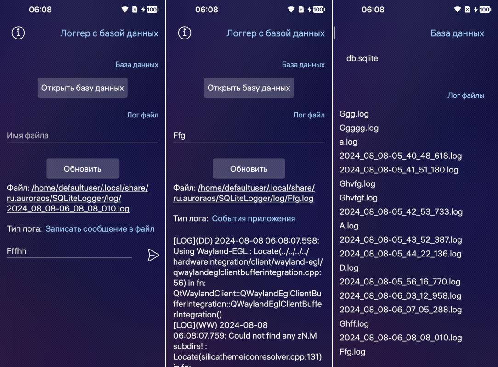

# SQLite Logger

The application demonstrates the operation of the logger. It is possible to write lines to a file, monitor the dbus and also log application events.
A sqlite database is also created using the QtSql module. Log file information is written to the database.

## Terms of Use and Participation

The source code of the project is provided under [the license](LICENSE.BSD-3-CLAUSE.md),
that allows it to be used in third-party applications.

The [contributor agreement](CONTRIBUTING.md) documents the rights granted by contributors
to the Open Mobile Platform.

For information about contributors see [AUTHORS](AUTHORS.md).

[Code of conduct](CODE_OF_CONDUCT.md) is a current set of rules of the Open Mobile
Platform which informs you how we expect the members of the community will interact
while contributing and communicating.

## Project Structure

The project has a common structure
of an application based on C++ and QML for Aurora OS.

* **[ru.auroraos.SQLiteLogger.pro](ru.auroraos.SQLiteLogger.pro)** file describes the project structure for the qmake build system.
* **[icons](icons)** directory contains application icons for different screen resolutions.
* **[qml](qml)** directory contains the QML source code and the UI resources.
  * **[assets](qml/icons)** directory contains the custom UI icons.
  * **[cover](qml/cover)** directory contains the application cover implementations.
  * **[pages](qml/pages)** directory contains the application pages.
  * **[SQLiteLogger.qml](qml/SQLiteLogger.qml)** file provides the application window implementation.
* **[rpm](rpm)** directory contains the rpm-package build settings.
  **[ru.auroraos.SQLiteLogger.spec](rpm/ru.auroraos.SQLiteLogger.spec)** file is used by rpmbuild tool.
* **[src](src)** directory contains the C++ source code.
  * **[database](src/database)** directory contains.
  * **[logger](src/logger)** directory contains.
  * **[main.cpp](src/main.cpp)** file is the application entry point.
* **[translations](translations)** directory contains the UI translation files.
* **[ru.auroraos.SQLiteLogger.desktop](ru.auroraos.SQLiteLogger.desktop)** file defines the display and parameters for launching the application.

## Screenshots

## This document in Russian / Перевод этого документа на русский язык

- [README.ru.md](README.ru.md)
